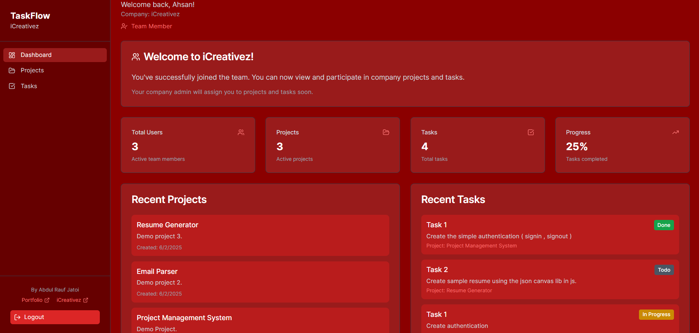
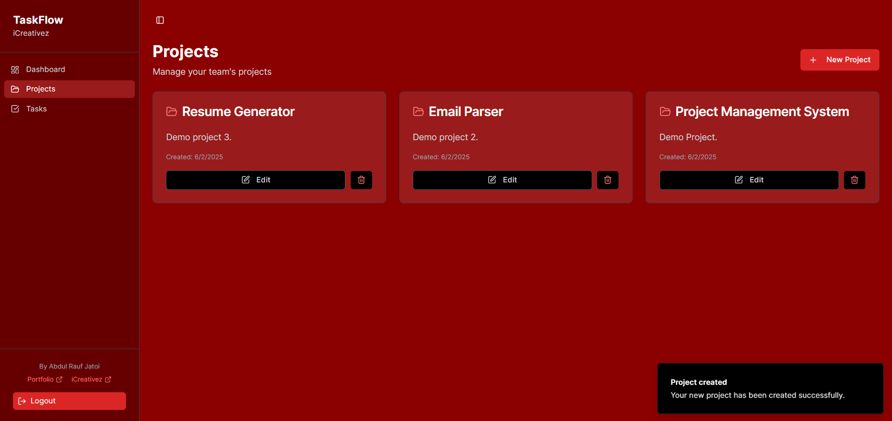
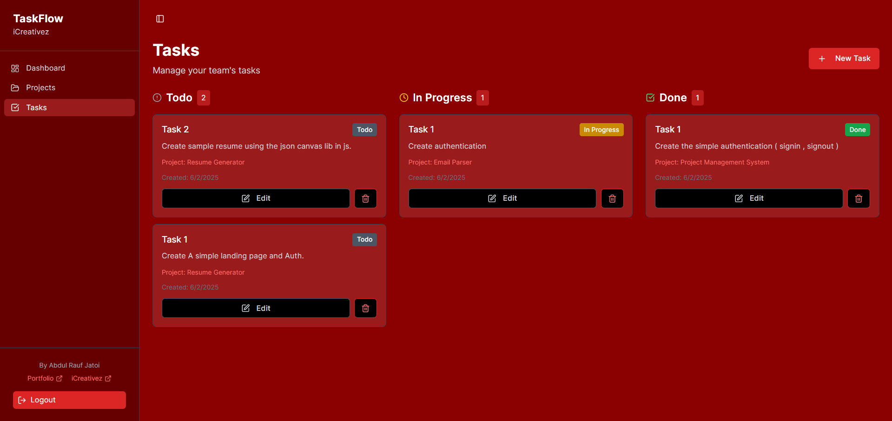
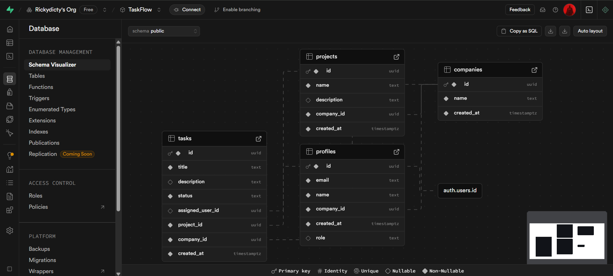

# Taskflow – Multi-Tenant Project Management System


> A secure and modern project & task management system where **companies manage projects privately** in a multi-tenant environment.

---

## 🌟 Overview

**Taskflow** is a full-stack, multi-tenant web app built with **React + Vite**, **Supabase**, and **Tailwind CSS**, designed to help multiple companies (tenants) manage their own users, projects, and tasks securely.

---

## ✨ Features

### 🔐 Authentication
- Signup/Login via **JWT**
- On signup, users **create or join a company**
- Each user belongs to **only one company**

### 🏢 Multi-Tenancy
- All users, projects, and tasks are tied to a `companyId`
- Users can **only access their company’s data**

### 📊 Dashboard
- Displays total **users**, **projects**, and **tasks**
- All stats filtered per company

### 📁 Project Management
- Create, edit, and delete projects
- View only your company’s projects

### ✅ Task Management
- Create tasks under projects
- Tasks include:
  - `Title`, `Description`
  - `Status`: To Do, In Progress, Done
  - `Assigned user` (from the same company)

### 🎨 UI/UX
- **Dark red + white** color theme
- Styled with **Tailwind CSS**
- Built using **shadcn/ui** components for a clean, minimal design

---

## 🛠️ Tech Stack

| Tech         | Role                            |
|--------------|----------------------------------|
| React + Vite | Frontend Framework & Dev Server |
| Supabase     | Backend + Auth + Database       |
| Tailwind CSS | Utility-first CSS styling       |
| shadcn/ui    | Component system                |
| JWT          | Auth token management           |

---

## 📸 Screenshots

### 🖥️ Dashboard



### 📁 Project View



### ✅ Task View



---

## 🗄️ Supabase Schema



---

## 🚀 Getting Started

Clone the repository and set up the environment variables:

```bash
# Clone the repo
git clone https://github.com/Raufjatoi/TaskFlow
cd taskflow

# Install dependencies
npm install

# Add your Supabase env keys
cp .env.example .env
# Then update .env with:
# VITE_SUPABASE_URL=your-supabase-url
# VITE_SUPABASE_ANON_KEY=your-anon-key

# Start the development server
npm run dev
```

# 👤 Author 

[Abdul Rauf Jatoi](https://raufjatoi.vercel.app/)   

# 🤝 Contributing

If you'd like to contribute, feel free to fork the repo and submit a pull request. All suggestions and improvements are welcome!